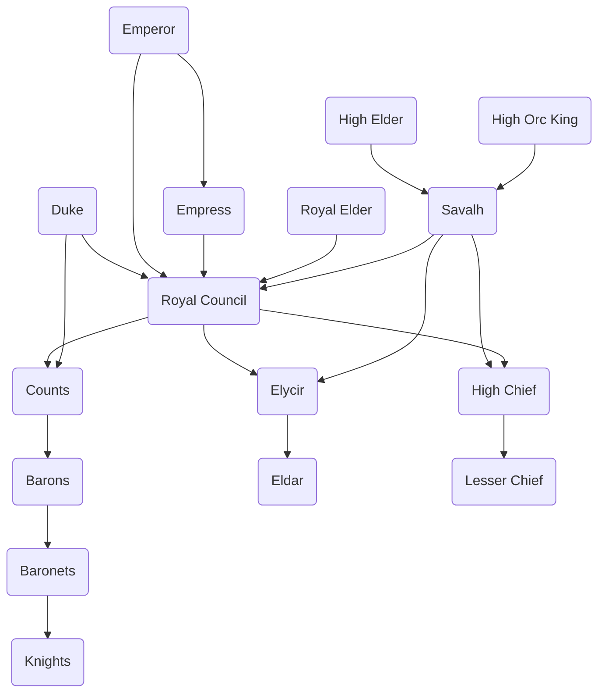

---
{"dg-publish":true,"permalink":"/development/aentis/countries/eusacix-continent/nations/hestein-empire/","tags":["Nations"],"created":"2024-01-29T23:21:25.895-08:00","updated":"2025-02-27T02:34:06.543-08:00"}
---

Leader: [[Development/Aentis/Characters/Nations/Hestein/Allen II Hestein\|Allen II Hestein]]
Leader Title: Emperor
Founder: [[Development/Aentis/Characters/Historical/Hestein Bloodline/Oswin Hestein\|Oswin Hestein]]
Official State Religion: [[Development/Aentis/Factions/Religion/Established Churches/Gladia Church\|Gladia Church]]
Secondary Religions: [[Development/Aentis/Factions/Religion/Established Churches/Solar Faith\|Solar Faith]] , [[Development/Aentis/Factions/Religion/Established Churches/Zenith Temple\|Zenith Temple]]
Government: [[Development/Aentis/Political Systems (PS)/Henerschy\|Henerschy]]
Capital: Roseward
Main Population: Humans (Hesteinese and Lhumigians), Orcs, Hobgoblins, Goblins, Halflings, and Kobolds
Official Language: [[Development/Aentis/Data/Languages/National/Hattei\|Hattei]]
Secondary Languages: [[Development/Aentis/Data/Languages/Continental/Danvar\|Danvar]], [[Development/Aentis/Data/Languages/Ethnical/Hestein/Ennyl\|Ennyl]] , [[Development/Aentis/Data/Languages/Ethnical/Hestein/Gespic\|Gespic]], [[Development/Aentis/Data/Languages/Ethnical/Hestein/Oklali\|Oklali]]
Motto/Slogan: One struggle, one people, one destiny.
Alternative Names: Hestein
Demonym: Hesteinese
Founding Date: 39/10/450 EE

---
The Hestein Empire is a relative new nation formed with 350 years of history. It was founded by [[Development/Aentis/Characters/Historical/Hestein Bloodline/Oswin Hestein\|Oswin Hestein]] also known as The Father Founder.

---
## Structure
Hestein has a political system called [[Development/Aentis/Political Systems (PS)/Henerschy\|Henerschy]]. This political structure is divided in the following hierarchy:

---
