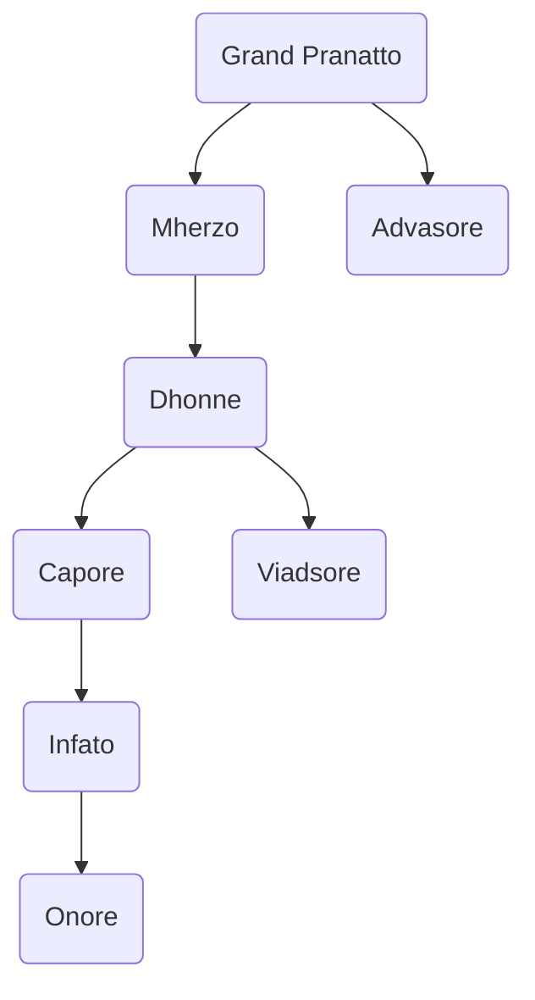

---
{"dg-publish":true,"permalink":"/development/aentis/factions/criminal/scarlet-cloaks/","tags":["Factions","FC"],"created":"2025-02-25T14:04:57.848-08:00","updated":"2025-02-25T17:04:48.079-08:00"}
---

Founding Date: 662
Influence Range: 

---
Description: [[Development/Aentis/Factions/Criminal/Scarlet Cloaks\|Scarlet Cloaks]] are an organized crime syndicate that has taken control over the Tumbrove region and a little part of the Banit region. They have overpower the local government and conquer all the villages close to their Headquartets, [[Development/Aentis/Settlements/Hestein Empire/Wheattalon Duchy/Hazelminster County/HM Towns/Pawic\|Pawic]], and are in constant struggle with the neighboring nobles of the [[Development/Aentis/Countries/Eusacix Continent/Nations/Hestein Empire\|Hestein Empire]] in the region, who are trying to retake the lost territory.

---
## Organization

Current Leader: [[Development/Aentis/Characters/Factions/Criminal/Scarlet Cloaks/Smerd Nai\|Smerd Nai]]
HQ: [[Development/Aentis/Settlements/Hestein Empire/Wheattalon Duchy/Hazelminster County/HM Towns/Pawic\|Pawic]]
#### Structure: 
The Structure of the Organization is a tied relationship between members becoming sworn siblings of each other and adopting subordinates below them as a godchild or protege. 

The general structure of the organization is the following:

There's 4 Families lead by their respective figure head, a [[Development/Aentis/Data/Political/Titles & Ranks/Criminal/Scarlet Cloaks/Dhonne\|Dhonne]]:
- [[Development/Aentis/Characters/Factions/Criminal/Scarlet Cloaks/Syone Supleto\|Syone Supleto]]: In charge of [[Development/Aentis/Settlements/Hestein Empire/Wheattalon Duchy/Hazelminster County/HM Towns/Galepoint\|Galepoint]]
- [[Development/Aentis/Characters/Factions/Criminal/Scarlet Cloaks/Rathine Tezhare\|Rathine Tezhare]]: In charge of [[Development/Aentis/Settlements/Hestein Empire/Wheattalon Duchy/Hazelminster County/HM Villages/Prim\|Prim]]
- [[Development/Aentis/Characters/Factions/Criminal/Scarlet Cloaks/Kyuta Phaggal\|Kyuta Phaggal]]: In charge of [[Development/Aentis/Settlements/Hestein Empire/Wheattalon Duchy/Hazelminster County/HM Villages/Dulch\|Dulch]] & [[Development/Aentis/Settlements/Hestein Empire/Wheattalon Duchy/Hazelminster County/HM Villages/Kamell\|Kamell]]
- [[Development/Aentis/Characters/Factions/Criminal/Scarlet Cloaks/Ghattar Burtado\|Ghattar Burtado]]: In charge of [[Development/Aentis/Settlements/Hestein Empire/Wheattalon Duchy/Hazelminster County/HM Villages/Quillbluff\|Quillbluff]] & [[Development/Aentis/Settlements/Hestein Empire/Wheattalon Duchy/Hazelminster County/HM Villages/Thauma\|Thauma]]

---
## Public Agenda

Motto/Slogan: The price one must pay for power is blood.
Principles/Creed/Objectives:

---
## Culture

Ideals:
Values:
Symbolism:

Recruitment:

---
## History

Importance:

Conflicts:

---
## Assets

Earnings:
Expenses:

---
Notes: