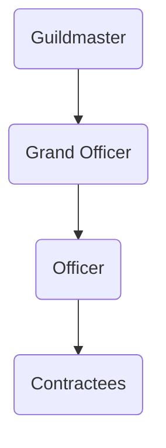

---
{"dg-publish":true,"permalink":"/development/aentis/factions/guilds/iron-walls/","tags":["Factions","FG"],"created":"2025-02-25T14:04:57.859-08:00","updated":"2025-02-25T17:03:08.074-08:00"}
---

Founding Date: 670
Influence Range: [[Development/Aentis/Data/Local Regions/Tumbrove\|Tumbrove]] and [[Development/Aentis/Data/Local Regions/Banit\|Banit]] region.

---
Description: The [[Development/Aentis/Factions/Guilds/Iron Walls\|Iron Walls]] is a security guild that operates inside the [[Development/Aentis/Data/Local Regions/Tumbrove\|Tumbrove]] and [[Development/Aentis/Data/Local Regions/Banit\|Banit]] region. The guild behaves like a mercenary guild with the restriction of staying on the protocols of defense and assist people inside their contracts.

---
## Organization

Current Leader: Beil Nallmehr
HQ: [[Development/Aentis/Settlements/Hestein Empire/Wheattalon Duchy/Hazelminster County/HM Towns/Pawic\|Pawic]]
#### Structure: 

The [[Development/Aentis/Data/Political/Titles & Ranks/Guild/Iron Walls/Contractees\|Contractees]] are classified in nickel, tin, copper, brass, bronze, iron, steel, silver and gold ranks.

The ranks provided different types of jobs, quality of contracts, and time duration.
The jobs are divided between:
- Custodian: escort missions
- Courier: delivery missions
- Sentinel: keep watch missions
- Guardian: protector missions

---
## Public Agenda

Motto / Slogan: Assist, Defend, Protect
Principles/Creed/Objectives:
- Provide Security for a price
- Secure contracts with profitable partners

---
## Culture

Ideals: The mission well being is first. Collaterals seconds.
Symbolism:
-  An Iron Wall with a sword crossing it
Recruitment:
- People can freely applied and will be given the lowest rank (nickel), and they will be paired with a higher rank member for missions until they have proved their worth and continue climbing the ranks.

---
## History

Importance:
The guild come out from the desired of a few mercenaries saw the necessity of security for general population and guilds once the [[Development/Aentis/Factions/Criminal/Scarlet Cloaks\|Scarlet Cloaks]] took over the [[Development/Aentis/Data/Local Regions/Tumbrove\|Tumbrove]] and [[Development/Aentis/Data/Local Regions/Banit\|Banit]] region.

Conflicts:
The Guild has had conflicts with different mercenary and criminal organizations that has put their seed in [[Development/Aentis/Settlements/Hestein Empire/Wheattalon Duchy/Hazelminster County/HM Towns/Pawic\|Pawic]] and their surroundings. 

---
Notes:
