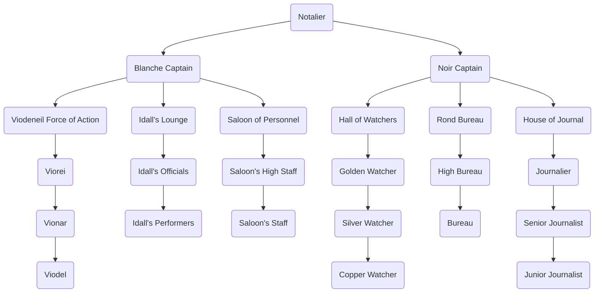

---
{"dg-publish":true,"permalink":"/development/aentis/factions/guilds/traveling-house-of-notes/","tags":["Factions","FG"],"created":"2025-02-25T14:04:57.869-08:00","updated":"2025-02-27T03:35:16.004-08:00"}
---

Code: FG-THN
Founding Date:
Influence Range: [[Development/Aentis/Countries/Eusacix Continent/Nations/Hestein Empire\|Hestein Empire]] 
Alternative Names: The House of Notes

---
Description: The Traveling House of Notes is a newspaper & traveling entertainment company designed to influence the hearth of Hestein's people. It tours all year, and recompiles local information for future custom shows for an entire region based on cultural differences and present traditions. It also provides news services to localities where they have established offices.

---
## Organization

Founder: [[Development/Aentis/Characters/Historical/Moolnos Naess\|Moolnos Naess]] 
Current Leader: [[Development/Aentis/Characters/Towns/Pawic/Hartmel Family/Jamell Hartmel\|Jamell Hartmel]] 
Leader Title: [[Development/Aentis/Data/Political/Titles & Ranks/Guild/Traveling House of Notes/Notalier\|Notalier]]
HQ: [[Development/Aentis/Settlements/Hestein Empire/Royal Province/Roseward\|Roseward]] 
### Structure: 
The structure of the Traveling House of Notes is shared by 2 divisions: the blanche and the noir.
This creates a dual structure below the Notalier, also knowns as the Guild Master, which oversees the organization's goals, needs, and wants. Below the Notalier, the hierarchy continues with the blanche captain and the noir captain, which are administrative holders of their own division; however, they don't share the same responsibilities.

#### The Blanche Division
The blanche division is the branch that stays on performance tours all year. They travel from settlement to settlement performing a few times in each of the location, earning capital and knowledge of the region. They also have the objective to spread important and relevant news to their public in a little section of their show called the "Faraway Whispers." 

The Blanche Division consist of 8 different ranks: [[Development/Aentis/Data/Political/Titles & Ranks/Guild/Traveling House of Notes/Blanche Captain\|Blanche Captain]], [[Development/Aentis/Data/Political/Titles & Ranks/Guild/Traveling House of Notes/Viorei\|Viorei]], [[Development/Aentis/Data/Political/Titles & Ranks/Guild/Traveling House of Notes/Vionar\|Vionar]], [[Development/Aentis/Data/Political/Titles & Ranks/Guild/Traveling House of Notes/Viodel\|Viodel]], [[Development/Aentis/Data/Political/Titles & Ranks/Guild/Traveling House of Notes/Idall's Officials\|Idall's Officials]], [[Development/Aentis/Data/Political/Titles & Ranks/Guild/Traveling House of Notes/Idall's Performers\|Idall's Performers]], [[Development/Aentis/Data/Political/Titles & Ranks/Guild/Traveling House of Notes/Saloon's High Staff\|Saloon's High Staff]], and [[Development/Aentis/Data/Political/Titles & Ranks/Guild/Traveling House of Notes/Saloon's Staff\|Saloon's Staff]].

Subdivisions:
- [[Development/Aentis/Factions/Guilds/Subdivisions/Traveling House of Notes/Viodeneil Force of Action\|Viodeneil Force of Action]]
- [[Development/Aentis/Factions/Guilds/Subdivisions/Traveling House of Notes/Idall's Lounge\|Idall's Lounge]]
- [[Development/Aentis/Factions/Guilds/Subdivisions/Traveling House of Notes/Saloon of Personnel\|Saloon of Personnel]]

#### The Noir Division 
The noir division is mostly idle staff that maintains local buildings and also share news to the local people. They process finances, assets, and information to redirect them towards inversion and maintenance of the guild. They also work as a newspaper company. They place journalist to get local information and delivered it to their associates and the locals. At the same time, they share regional or nation wide information provided by the Blanche Division, Royal decrees, and thirds party associates.

The Noir Division consist of 10 different ranks: [[Development/Aentis/Data/Political/Titles & Ranks/Guild/Traveling House of Notes/Noir Captain\|Noir Captain]], [[Development/Aentis/Data/Political/Titles & Ranks/Guild/Traveling House of Notes/Golden Watcher\|Golden Watcher]], [[Development/Aentis/Data/Political/Titles & Ranks/Guild/Traveling House of Notes/Silver Watcher\|Silver Watcher]], [[Development/Aentis/Data/Political/Titles & Ranks/Guild/Traveling House of Notes/Copper Watcher\|Copper Watcher]], [[Development/Aentis/Data/Political/Titles & Ranks/Guild/Traveling House of Notes/High Bureau\|High Bureau]], [[Development/Aentis/Data/Political/Titles & Ranks/Guild/Traveling House of Notes/Bureau\|Bureau]], [[Development/Aentis/Data/Political/Titles & Ranks/Guild/Traveling House of Notes/Journalier\|Journalier]], [[Development/Aentis/Data/Political/Titles & Ranks/Guild/Traveling House of Notes/Senior Journalist\|Senior Journalist]], and [[Development/Aentis/Data/Political/Titles & Ranks/Guild/Traveling House of Notes/Junior Journalist\|Junior Journalist]].

Subdivisions:
- [[Development/Aentis/Factions/Guilds/Subdivisions/Traveling House of Notes/Hall of Watchers\|Hall of Watchers]]
- [[Development/Aentis/Factions/Guilds/Subdivisions/Traveling House of Notes/Rond Bureau\|Rond Bureau]]
- [[Development/Aentis/Factions/Guilds/Subdivisions/Traveling House of Notes/House of Journal\|House of Journal]]

#### Hierarchical Structure:

---
## Public Agenda

Motto / Slogan: Our people, our laughter, our history
Ideals:
- Provide entertainment to every region of the [[Development/Aentis/Countries/Eusacix Continent/Nations/Hestein Empire\|Hestein Empire]].
- Share our knowledge with our people.
- Maintain everyone well informed.
---
## History

#### Importance:
The conquest of the south was once a kingdom called Lhumigial Kingdom, and Hestein, in its efforts to expand, conquered the nation by mighty military power and making alliance with the orc tribes. They cared to pacify the people to stabilize the new territories incorporated to the nation.

---
Notes: