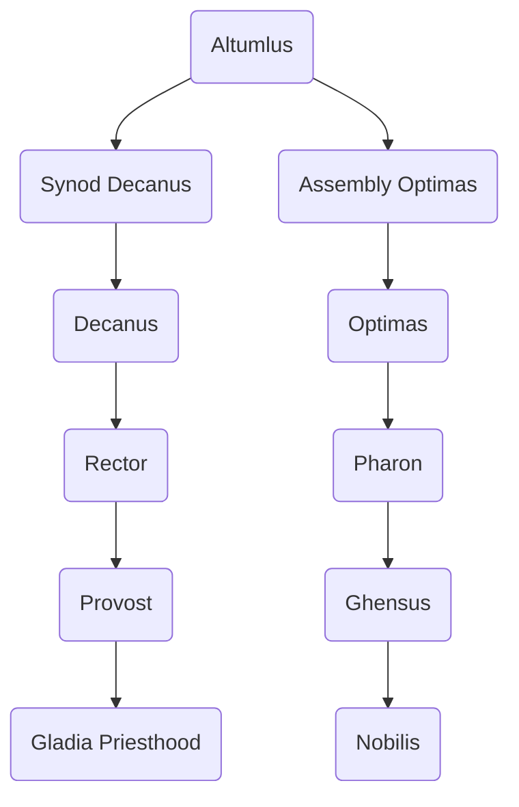

---
{"dg-publish":true,"permalink":"/development/aentis/factions/religion/established-churches/gladia-church/","tags":["Factions","FR"],"created":"2025-02-25T14:04:57.881-08:00","updated":"2025-02-26T21:46:33.886-08:00"}
---

Demonym: Gladians
Founding Date: 470 EE
Influence Range:

---
Description: The Gladia Church is a local Hestein religion. It originated in the North of the [[Development/Aentis/Countries/Eusacix Continent/Nations/Hestein Empire\|Hestein Empire]] through "The Great Stabilization." The Gladia Church influence is enormous among the aristocrats. The fundamental values of the church coordinate so well with the nobility's values that some noble families participate directly on the church. The religion centers around [[Development/Aentis/Pantheons & Philosophies/The Rightful Honor\|The Rightful Honor]] pantheon, which they believe are the symbol of noblesse.

---
## Organization

Founder: 
Current Leader: 
HQ: [[Development/Aentis/Countries/Eusacix Continent/Nations/Hestein Empire\|Hestein Empire]]
#### Structure: 

---
## Tenets of Faith

While there are many regulations, rituals, and traditions, every single one origins from the **"Core Tenents."** This Core Tenents are only 16 in number. Anyone who considers itself a follower of the [[Development/Aentis/Factions/Religion/Established Churches/Gladia Church\|Gladia Church]] follows this fundamental principles.
#### A. Knowledge and Royalty

A:A One must respect the aristocratic sovereignty for it is a divine gift.
A:B One must not permit any kind of corruption in their noble home.
A:C One should trive in the knowlegde of their ancestors and their history.
A:D One should always seek guideness in the accomplishments of its house.
#### B. Honor and Proudness
B:A One should maintain itself civil as much as possible as it is a way to maintain one's honor.
B:B One should not break an oath in name of their house.
B:C One must respect a pact of antiquity as it is sealed under the name of the gods.
B:D One should not tolerate a spark of shame under its name.
#### C. Charisma and Cleverness

C:A One must flourish in the way of the tongue as if the gods were speaking.
C:B One should master the way of kinesics as it is the path to understanding.
C:C One should try its best to decipher and anticipate the information of their opponent.
C:D One must comprehend the skills to become wiser with every piece of knowleged acquired.
#### D. Mercy and Punishment

D:A One should always serve a punishment honoroble of the act of malice.
D:B One should always serve an act of kindness equal or more of the act of benevolence.
D:C One should balance their judgement of another between their acts of goodness and wickednesses.
D:D One should always do the Misehena Rite at the time of given a verdict of mercy or punishment.

---
Notes: