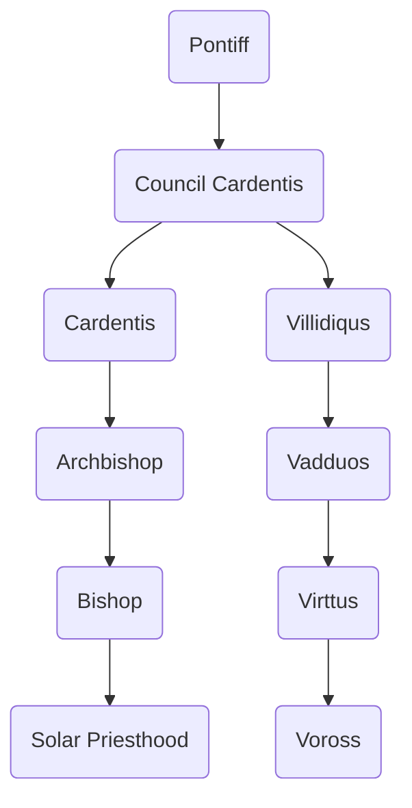

---
{"dg-publish":true,"permalink":"/development/aentis/factions/religion/established-churches/solar-faith/","tags":["Factions","FR"],"created":"2025-02-25T14:04:57.883-08:00","updated":"2025-02-26T21:46:19.448-08:00"}
---

Demonym: Solars
Founding Date: 15 EE
Influence Range:

---
Description: The Solar Fate is a local Hestein religion. It originated in the south of the [[Development/Aentis/Countries/Eusacix Continent/Nations/Hestein Empire\|Hestein Empire]]. It spread throughout the north when the Empire sought expansion in the south. The Solar Fate influence is enormous among the hardworking people, peasants. The fundamental values of the faith coordinate so well with the peasants' values. Almost as if the religion's point is to empower the working class. The religion centers around [[Development/Aentis/Pantheons & Philosophies/The Generous Duty\|The Generous Duty]] pantheon, which they believe are the purest of every other god.

---
## Organization

Founder:
Current Leader: 
HQ: [[Development/Aentis/Countries/Eusacix Continent/Nations/Hestein Empire\|Hestein Empire]]
#### Structure: 

---
## Tenets of Faith

While there are many regulations, rituals, and traditions, every single one origins from the **"Core Tenents."** This Core Tenents are only 16 in number. Anyone who considers itself a follower of the [[Development/Aentis/Factions/Religion/Established Churches/Solar Faith\|Solar Faith]] follows this fundamental principles.
#### _A. Nature and Knowledge_

A:A One should never abuse the force of nature.
A:B One should value nature as it was gifted by the gods to all creation.
A:C One should respect its life as well as others as its nature in itself.
A:D One should reciprocate what the world has given.
#### _B. Labor and Rest_

B:A One should always try to be the image of hard-working person.
B:B One should be the image of perseverance.
B:C One must rest the same amount of what one works.
B:D One must feast its fatigue.
#### _C. Justice and Light_

C:A One should maintain itself pure in its principles of morality.
C:B One must protect those who are weak from the wicked.
C:C One must have a lighted candle that vigils their house at night.
C:D One should follow the divine law as it is divine and just.
#### _D. Humility and Gratefulness_

D:A One should maintain itself humble as it is the path to paradise.
D:B One should greed someone's else determination, but never the products of other's determination.
D:C One must pray once a week as its the way to thank the deities.
D:D One should meditate the origins of the daily gifts recieved and be thankful.

---
Notes: