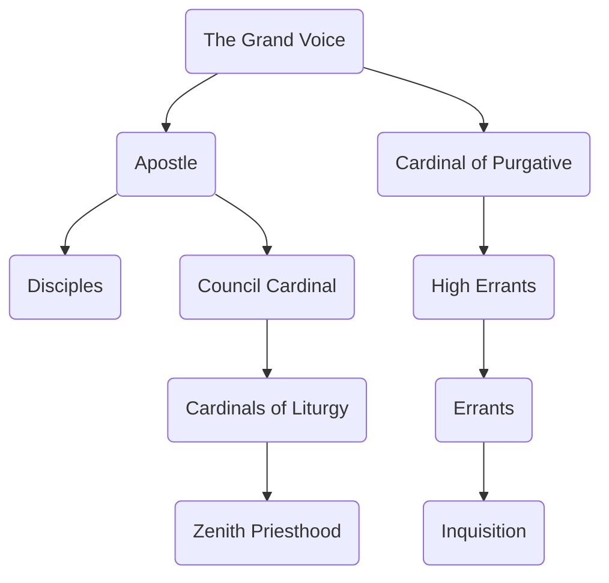

---
{"dg-publish":true,"permalink":"/development/aentis/factions/religion/established-churches/zenith-temple/","tags":["Factions","FR"],"created":"2025-02-25T14:04:57.884-08:00","updated":"2025-02-26T21:59:27.706-08:00"}
---

Demonym: Zeniths
Influence Range:

---
Description: The Zenith Temple is a popular international religion that has deepened in the adoration of [[Development/Aentis/Pantheons & Philosophies/The Natal Indulgence\|The Natal Indulgence]] pantheon. Also, it is one of the oldest religions known to mankind. In their beliefs, they deemed [[Development/Aentis/Characters/Deities/The Natal Indulgence/Dhoven\|Dhoven]], the creator, as the supreme god the rules over the other gods. Their teachings and beliefs comes from the [[Development/Aentis/Data/Books & Excerpts/A‌phodox\|A‌phodox]] which reveals to their followers the beginning of the world to the end of it and their way to salvation.

---
## Organization

Founder:
Current Leader: 
Parent Org: [[Development/Aentis/Countries/Eusacix Continent/Nations/Dhavalon\|Dhavalon]] 
HQ: [[Development/Aentis/Countries/Eusacix Continent/Nations/Dhavalon\|Dhavalon]]
#### Structure: 

---
## Tenets of Faith
Comming Soon...

---
Notes: